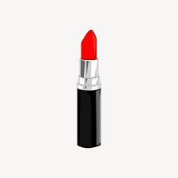

# Lipstick Try-On Filter Mobile App - PERN-Stack with React Native 

This app allows users to upload images of lipstick products and photos of themselves to virtually try on a lipstick shade. It has the following functions: 

* User account system with JWT Authentication
* Import from Phone's Media Library to upload lipstick images
* Import photo of user from media library/ Take Photo with Camera Feature 
* Displays image of user with lipstick shade on

# Example

    
    ➡️
    
    ➡️
    

# Data Flow

Frontend (RN) -> S3 with Images from User -> Backend(Express) -> S3 with Image with Applied Lipstick Filter -> Frontend (RN)

User uploads images of product and picture of themselves to frontend (React Native/RN). RN sends image URIs to AWS S3. Backend runs a Python Script - applyFilter.py - that makes a request to get access to S3 bucket to grab image URLs. Within the Python Script, the image gets converted to byte data then to numpy array for OpenCV to use. App uses HSV Color Masking to isolate the region, containing red/pink colors. OpenCV library is used to extract the BGR->RGB values. MediaPipe FaceMesh uses facial landmarks to isolate lip region and apply the color onto the lips. Final image gets uploaded to S3. Backend adds the S3 key of the finished image to PostgreSQL database related to the user id. Frontend then gets the most recently added image's S3 Key. Using this key, Frontend makes a request to backend to generate a GET Pre-Signed URL to get the finished image from the S3 database to display to the user. 

# Known Issues 

This app works best on images pulled off of websites or Google where the background is plain. Since the specified color range includes reds/pinks, and sometimes skin color can fall within that range,  the masking region isn't as precise on images of swatches on skin in comparison to images of just tubing/packaging. For future purposes, this app would work best if it can train a model to be able to reliably detect swatches in a variety of circumstances. As of right now, it does not. 

